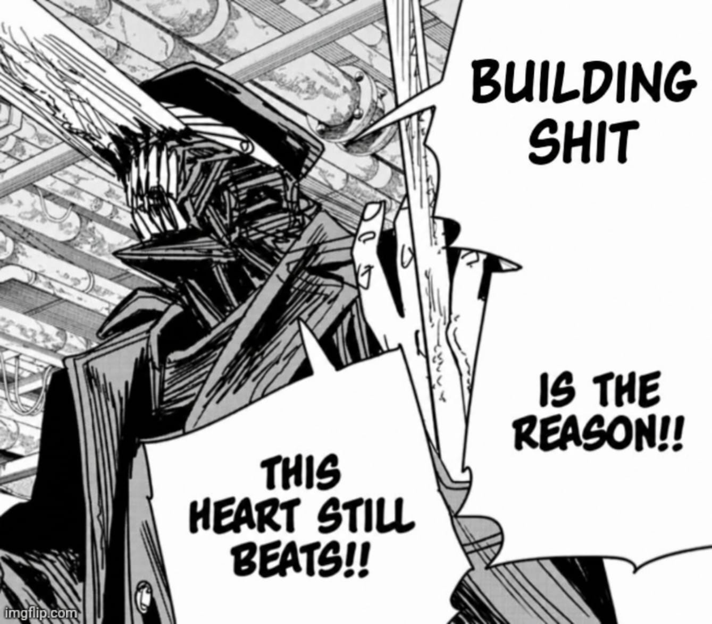

<div align="center">

<a href="https://github.com/kukyos?tab=repositories"></a>

# A M Armaan


<br/>

<a href="https://www.linkedin.com/in/armaansucks"></a>
<a href="mailto:amohamed@karunya.edu.in"></a>
<a href="https://github.com/kukyos?tab=repositories"></a>

<br/>

</div>

```
i build some tuff stuff.

now      agentic AI systems, simulation work, and slop websites
like     earning money, doing cool shit
             ground states, black holes, fish schooling
built    client tooling for Blackstone Elevators
             a full hackathon platform, end to end
reach    amohamed@karunya.edu.in
```

<br/>

<table>
<tr><td valign="top" width="50%">

**languages**
```
TypeScript   Python   C   C++   C#
JavaScript   HTML     CSS  Larp 
```

</td><td valign="top" width="50%">

**tools**
```
React  Next.js  Tailwind  Node  Flask
Django  Unity  Postgres  MySQL  Vercel

Mostly claude though
```

</td></tr>
</table>

<br/>

## built

| | | | |
|---|---|---|---|
| **Simathon** | a hackathon run end to end — [entry portal](https://github.com/kukyos/simathon), [project gallery](https://github.com/kukyos/SimGallery), [judging system](https://github.com/kukyos/JudgingSimathon) | `TypeScript` | [live](https://simathon.vercel.app) |
| **[Lancist](https://github.com/kukyos/Lancist)** | outreach bot for the Oryn agency — scrapes local SMB leads, audits their sites, drafts and sends the cold email | `Python` | |
| **[Ecat](https://github.com/kukyos/Ecat)** · **[blackstoneforms](https://github.com/kukyos/blackstoneforms)** | e-catalogue and digital form filler, built for Blackstone Elevators | `TypeScript` | [live](https://ecat-one.vercel.app) |
| **[NullChat](https://github.com/kukyos/NullChat)** | chatbot that sees, speaks, and handles any language you throw at it | `Python` | |
| **[GlobeTrotter](https://github.com/kukyos/GlobeTrotter)** | trip planner, Odoo hackathon | `TypeScript` | [live](https://globe-trotter-brown.vercel.app) |
| **[Synapse](https://github.com/kukyos/Synapse)** | Weboin internship submission | `TypeScript` | [live](https://synapse-wheat-nu.vercel.app) |

## simulated

| | | | |
|---|---|---|---|
| **[GroundStateFinder](https://github.com/kukyos/GroundStateFinder)** | searches for the ground state of a system | `Python` | |
| **[SingularityEngine](https://github.com/kukyos/SingularityEngine)** | black hole renderer | `Python` | |
| **[fishschooling-sim](https://github.com/kukyos/fishschooling-sim)** | emergent flocking, written in C | `C` | |
| **[ForeHeadDetector](https://github.com/kukyos/ForeHeadDetector)** | framework for tracking a forehead, or the middle of a head | `Python` | |

<div align="center"><sub><a href="https://github.com/kukyos?tab=repositories">all 40+ repos</a></sub></div>

<br/>

## stats

<div align="center">


<br/><br/>


<br/><br/>

<sub></sub>

</div>
